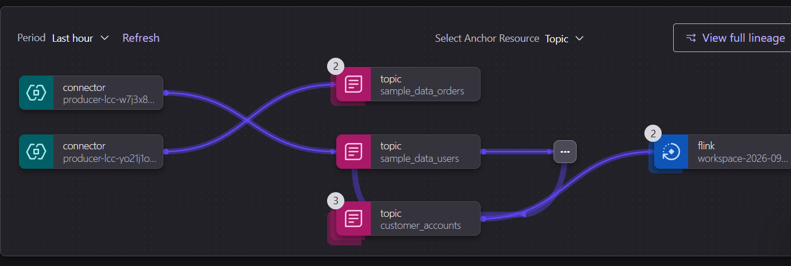

# CustomerPulse ⚡
> **Open-Source Real-Time Customer Friction & Churn Prevention Platform for Modern Businesses**  
> *Powered by Confluent Cloud, Apache Kafka, and Apache Flink SQL Stream Processing.*

[](LICENSE)
[](https://confluent.cloud)
[](https://flink.apache.org/)

---

## 💡 Why CustomerPulse?

Traditional customer churn analytics rely on batch jobs running 24 to 48 hours after customer dissatisfaction occurs — by then, the customer has already left, closed the browser, or cancelled their subscription.

**CustomerPulse** transforms customer retention into an **active, real-time streaming defense system**:
1. **Zero-Lag Event Ingestion:** Captures high-velocity user clickstreams, cart stalls, and friction events via Kafka and the embeddable `tracker.js` SDK.
2. **Point-in-Time Account Enrichment:** Performs temporal table joins with customer account profiles in real time (`customer_accounts` + `customer_clickstream` &rarr; `enriched_clickstream`).
3. **Behavioral Friction Index (CFI):** Uses Apache Flink SQL windowed streams to calculate friction intensity (detecting payment errors, checkout hesitation, rage clicks, and support tickets).
4. **Automated Sub-Second Interventions:** Dynamically routes personalized retention playbooks (VIP Slack alerts, rescue discount promo codes, concierge assistance) at the exact moment of friction before the visitor abandons their session.

---

## 📊 Core Capabilities for Business Owners

- **Live Activity & Retention Dashboard:** Real-time visibility into active visitors, at-risk sessions, and preserved revenue in a clean, uncluttered light mode.
- **Customer Friction & Churn Inspector:** Monitor individual visitors (`Enterprise`, `Growth`, `Starter`), inspect real-time click trails, and review individual churn risk scores.
- **1-Click & Automated Rescue Actions:**
  - *Cart Abandonment Rescue:* Sends instant 15% discount promo code (`RESCUE15`) before tab closure.
  - *Enterprise VIP Dispatch:* Automated webhook dispatch to Customer Success Slack/Discord channels when high-value accounts encounter friction.
  - *Proactive Support:* Pushes immediate help widget for users with payment issues.
- **Embeddable Web Tracker SDK:** A lightweight client-side script (`tracker.js`) ready to copy-paste into any website, Next.js app, or Shopify store.
- **Interactive Storefront Sandbox (`demo-store.html`):** A developer hardware & cloud storefront that emits real HTTP telemetry so you can test customer journeys live.
- **Audit Export:** 1-click export of customer retention audits in CSV format.

---

## 🏗️ Confluent Data Streaming Architecture

```
┌─────────────────────────────────┐
│ Client Telemetry (tracker.js)   │───────► [customer_clickstream]
└─────────────────────────────────┘                       │
                                                          ▼
┌─────────────────────────────────┐           ┌────────────────────────┐
│ Customer Accounts (Dimension)   │───────►   │  enriched_clickstream  │
│ PRIMARY KEY user_id             │           │ (Temporal Table Join)  │
└─────────────────────────────────┘           └────────────────────────┘
                                                          │
                                                          ▼
                                              ┌────────────────────────┐
                                              │ retention_interventions│
                                              │ (1-Min Window + Action)│
                                              └────────────────────────┘
                                                          │
                                         ┌────────────────┴────────────────┐
                                         ▼                                 ▼
                             ┌────────────────────────┐        ┌───────────────────────┐
                             │ CustomerPulse Dashboard│        │ Webhook Action Sinks  │
                             │ (Real-time WebSocket)  │        │                       │
                             └────────────────────────┘        └───────────────────────┘
```

---

## 🚀 Quick Start (Local Setup)

### 1. Clone & Install Dependencies
```bash
git clone https://github.com/jemslzr/customer-engagement.git
cd customer-engagement

# Install dependencies (Express & ws)
npm install
```

### 2. Configure Environment (Optional for Confluent Cloud)
Copy `.env.example` to `.env`:
```bash
cp .env.example .env
```
Fill in your Confluent Cloud cluster details (or run in standalone local mode out of the box).

### 3. Start the Server
```bash
npm run dev
```

- Open **`http://localhost:3000`** &rarr; Real-Time Customer Retention Dashboard
- Open **`http://localhost:3000/demo-store.html`** &rarr; Interactive Store Sandbox

---

## ☁️ Confluent Cloud & Flink SQL Setup

In your Confluent Cloud **Flink SQL Workspace**, run these statements sequentially:

### 1. Dimension Table: Customer Accounts
```sql
CREATE TABLE customer_accounts (
  user_id STRING NOT NULL,
  account_name STRING,
  tier STRING,
  mrr DOUBLE,
  email STRING,
  PRIMARY KEY (user_id) NOT ENFORCED
);

INSERT INTO customer_accounts (user_id, account_name, tier, mrr, email) VALUES
  ('user_seed_1', 'Acme Global Corp (Sarah Connor)', 'Enterprise', 1999.0, 'sarah@acmeglobal.com'),
  ('user_seed_2', 'David Miller Media', 'Growth', 499.0, 'david@millermedia.io'),
  ('user_seed_3', 'Nordic Logistics AB (Elena Rostova)', 'Enterprise', 1999.0, 'elena@nordiclog.se'),
  ('user_seed_4', 'Kenji Sato Labs', 'Growth', 499.0, 'kenji@satolabs.jp'),
  ('user_seed_5', 'Mendez Creative (Carlos Mendez)', 'Starter', 99.0, 'carlos@mendezcreative.com'),
  ('user_seed_6', 'Al-Mansoor Trading (Amira Al-Mansoor)', 'Growth', 499.0, 'amira@almansoor.ae');
```

### 2. Ingestion Table: Real-Time Clickstream
```sql
CREATE TABLE customer_clickstream (
  session_id STRING,
  user_id STRING,
  event_id STRING,
  event_type STRING,
  page_path STRING,
  cart_value DOUBLE,
  region STRING,
  duration_ms INT
);
```

### 3. Real-Time Temporal Enrichment Stream
```sql
CREATE TABLE enriched_clickstream AS
SELECT
  c.session_id,
  c.user_id,
  a.account_name,
  a.tier,
  a.mrr,
  c.event_type,
  c.page_path,
  c.cart_value
FROM customer_clickstream c
JOIN customer_accounts FOR SYSTEM_TIME AS OF c.`$rowtime` a
  ON c.user_id = a.user_id;
```

### 4. Real-Time Intervention Dispatch (Windowed Friction Aggregation)
```sql
CREATE TABLE retention_interventions AS
SELECT
  session_id,
  user_id,
  account_name,
  tier,
  mrr,
  COUNT(*) AS total_interactions,
  SUM(CASE
    WHEN event_type = 'payment_failed' THEN 45
    WHEN event_type = 'checkout_abandon' THEN 45
    WHEN event_type = 'rage_click' THEN 25
    WHEN event_type = 'support_query' THEN 20
    WHEN event_type = 'checkout_start' AND cart_value > 500 THEN 15
    ELSE 1
  END) AS friction_score,
  MAX(cart_value) AS exposed_cart_value,
  MAX(page_path) AS last_active_page,
  window_end AS calculated_at,
  CASE
    WHEN tier = 'Enterprise' AND SUM(CASE WHEN event_type IN ('payment_failed', 'checkout_abandon') THEN 45 ELSE 1 END) >= 40 THEN 'VIP_CSM_SLACK_ALERT'
    WHEN MAX(cart_value) >= 1000 THEN 'RESCUE_PROMO_15PCT'
    ELSE 'PROACTIVE_CHAT_OFFER'
  END AS recommended_action
FROM TABLE(
  TUMBLE(TABLE enriched_clickstream, DESCRIPTOR(`$rowtime`), INTERVAL '1' MINUTE)
)
GROUP BY session_id, user_id, account_name, tier, mrr, window_start, window_end
HAVING SUM(CASE
  WHEN event_type = 'payment_failed' THEN 45
  WHEN event_type = 'checkout_abandon' THEN 45
  WHEN event_type = 'rage_click' THEN 25
  WHEN event_type = 'support_query' THEN 20
  WHEN event_type = 'checkout_start' AND cart_value > 500 THEN 15
  ELSE 1
END) >= 30;
```

---